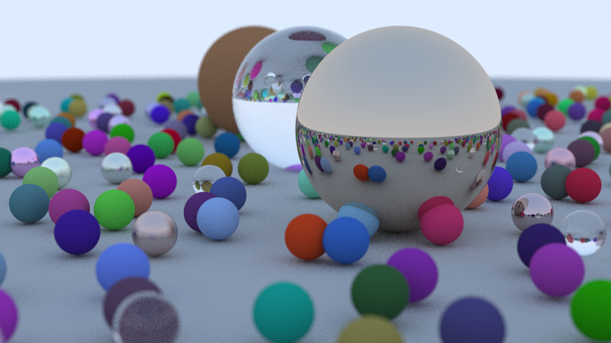

# Golang Ray Tracer

A ray tracer implementation in Go, following Peter Shirley's ["Ray Tracing in One Weekend"](https://raytracing.github.io/books/RayTracingInOneWeekend.html) series.

## Usage

```bash
go run cmd/raytracer/main.go > image.ppm
```

This renders the scene shown below.



The scene will vary slightly with each render. The three big spheres in the middle of the scene are fixed, the smaller spheres on the ground below are randomly placed in the scene at runtime.

## Features

- Parallel rendering using goroutines
- Multiple material types:
  - Lambertian (diffuse)
  - Metal (reflective with configurable fuzz)
  - Dielectric (glass/transparent)
- Camera features:
  - Adjustable field of view
  - Depth of field
  - Anti-aliasing
  - Configurable position and orientation
- Scene features:
  - Spherical geometry
  - Multiple object support
  - Sky gradient background

## Project Structure

- `camera/`: Camera implementation with configuration options
- `color/`: Color management and output
- `core/`: Core interfaces and data structures
- `hittable/`: Object intersection implementation
- `interval/`: Numerical interval utilities
- `material/`: Material definitions and light interaction
- `ray/`: Ray implementation
- `util/`: Common utility functions
- `vector/`: 3D vector mathematics

## Output

The renderer outputs in PPM (Portable Pixmap) format. You can convert the output to other formats using image manipulation tools like ImageMagick:

```bash
convert image.ppm image.png
```
